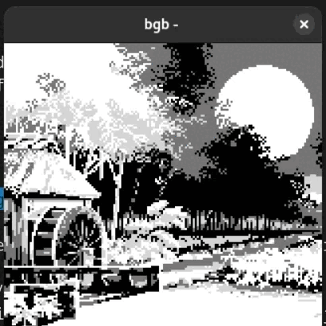

### Displaying images with more than 256 tiles in APA mode.

This program is built on a GBDK example that allows to show a single fullscreen image. (https://github.com/gbdk-2020/gbdk-2020/tree/develop/gbdk-lib/examples/gb/apa_image)

Images placed in the res/folder will be automatically converted into C code and compiled into the viewer.

Pressing the A or B button displays the next image.

Pixel art originally by RodrixAP under Creative Commons Attribution 2.0 Generic (CC BY 2.0)

https://www.flickr.com/photos/rodrixap/10591266994/in/album-72157637154901153/

